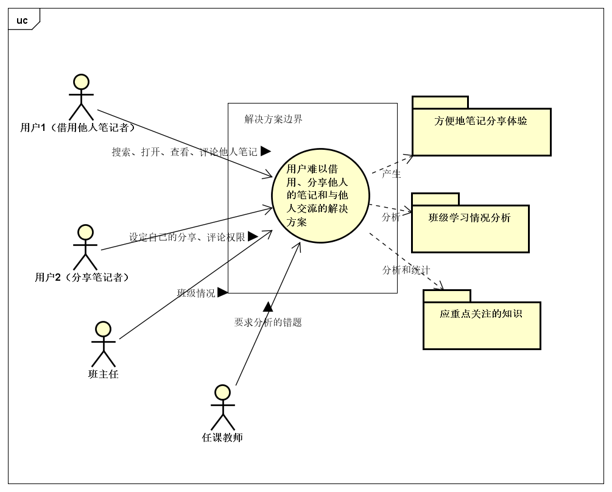
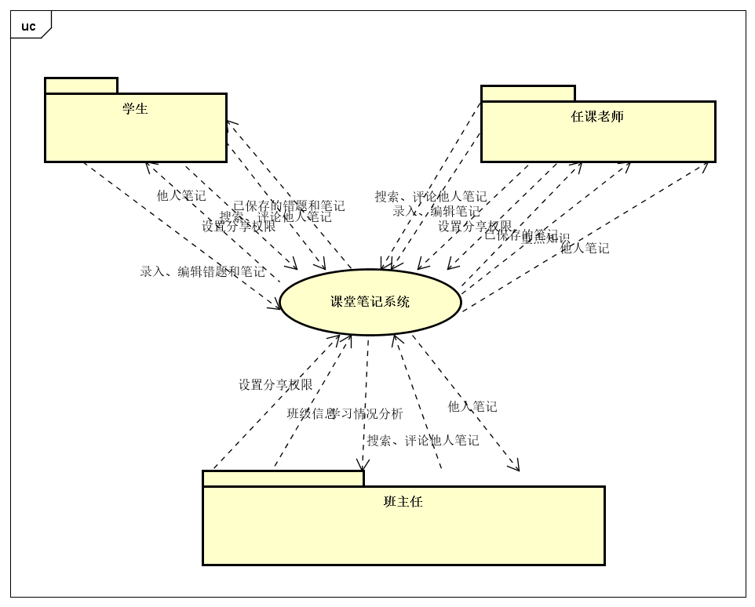
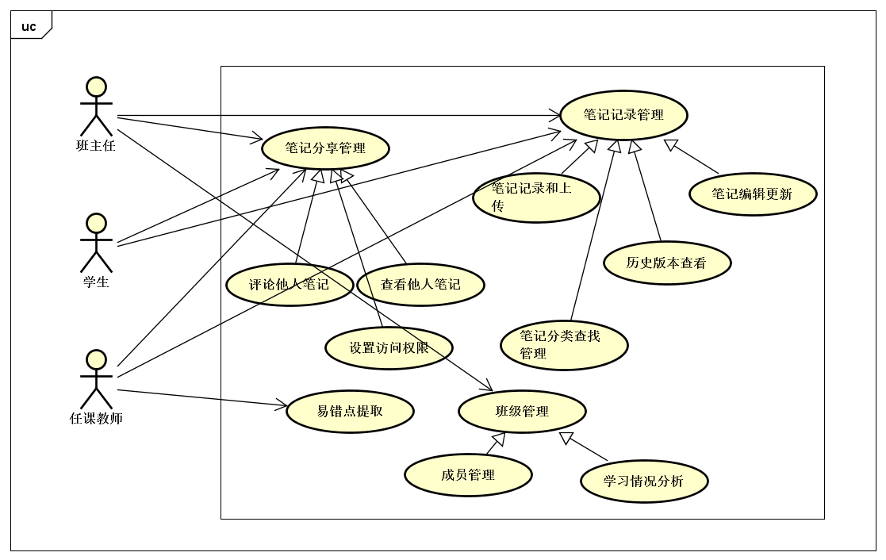

# 课堂笔记管理系统 问题分析过程

By Trap x00

<!-- TOC -->

- [课堂笔记管理系统 问题分析过程](#课堂笔记管理系统-问题分析过程)
- [0. 更新日志](#0-更新日志)
- [1. 明确问题](#1-明确问题)
  - [1.1 初步了解问题](#11-初步了解问题)
  - [1.2 面谈及其结果](#12-面谈及其结果)
  - [1.3 问题达成共识](#13-问题达成共识)
- [2. 涉众分析](#2-涉众分析)
  - [2.1 涉众识别和描述](#21-涉众识别和描述)
  - [2.2 涉众评估](#22-涉众评估)
- [3. 发现业务需求](#3-发现业务需求)
- [4. 定义解决方案及系统特性](#4-定义解决方案及系统特性)
  - [4.1 确定高层次的解决方案](#41-确定高层次的解决方案)
  - [4.2 确定系统特性和解决方案的边界](#42-确定系统特性和解决方案的边界)
  - [4.3 确定解决方案的约束](#43-确定解决方案的约束)
  - [4.4 确定系统边界](#44-确定系统边界)

<!-- /TOC -->

# 0. 更新日志

| 时间 | 修改人 | 版本号 | 理由 |
| -- | --- | -- | -- |
| 2018/10/3 | 陈俊达 | V1.0 | 第一版 |

# 1. 明确问题

## 1.1 初步了解问题

某高中在教学中发现，学生、任课老师、班主任在记录、管理、利用笔记和错题方便有很大的缺陷，花费了许多时间却不能达到预期地帮助学习（学生）、掌握学生知识掌握情况（任课老师）、掌握班级学习情况（班主任）的效果。

学生记录题目浪费时间，且难以在已有的笔记上进行修改。通过传统的分类方式将一道错题、一份笔记归类到一个类型里不够科学和全面，也不便于查找。

任课教师难以通过分散的学生错题和笔记情况得知学生的难点和易错点，也难以和其他老师交流教学经验。另外，教师长时间的教学经验积累了很多的笔记，这些笔记由于数量太多，不易保存和查阅。教室也不便于修改已有的笔记。

同样由于学生错题和笔记分布很分散，班主任很难通过笔记和错题来分析学生的学习情况，最终只能通过考试情况衡量学习质量。但是由于每个班级学生基本情况不同，每次考试的难易程度不同、着重点不同、偶然情况比较多（例如发挥失常/超常），仅使用考试情况衡量学习质量不够科学。

校长认为可以通过一个课堂笔记管理系统来改善现有的问题。

## 1.2 面谈及其结果

我们小组经过开会讨论，从中提取出了几个客户希望表达的问题和我们的开发人员的疑问并记录下来，然后与客户展开了第一次面谈，面谈报告如下：

| 要素 | 内容 |
| --- | --- |
| 会见者 | 王宁一 |
| 被会见者 | 涂斌砚 |
| 主题 | 关于目前课堂笔记和错题利用情况、问题和预期使用者和解决方案的初步了解 |
| 日期 | 2018年9月27日 |

通过这次面谈，我们得知了以下情况：

1. 系统的使用者

- 班主任
- 任课教师
- 学生

2. 现在使用者记录和使用错题和笔记的情况

| 使用者 | 使用 |
| ---- | --- |
| 学生 | 一个本子一个学科，出现错题就记录到错题本上，记满换一本 |
| 任课老师 | 按照教学方案、讲课顺序等记录，逢考试或练习记录同学们错误率较高的题目 |
| 班主任 | 主要使用考试情况衡量学生学习情况，未使用错题和笔记 |

3. 现在的解决方案的问题和缺陷
- 学生
    1. 错题出现的随机性导致很难找到特定类型的错题
    2. 笔记本太多，错题较少的科目笔记本利用程度不高
    3. 手抄题目浪费时间精力，剪切试卷影响试卷保存
    4. 迫切需要参考他人(成绩好的同学)的错题和笔记
- 教师
    1. 对学生难点易错点获取难度较大
    2. 教师间迫切需要更方便交流教学经验
    3. 教师教学时间长，笔记不易保存和查阅
    4. 对笔记部分更新较为困难(标注杂乱没有地方等) 
- 班主任
    1. 由于每个班级学生基本情况不同，每次考试的难易程度不同、着重点不同、偶然情况比较多（例如发挥失常/超常），仅使用考试情况衡量学习质量不够科学
    2. 错题和笔记过于分散和个人化，难以集中起来科学分析掌握学生学习情况

4. 对未来发展的希望和一些措施
    - 能够让用户用多种方式记录、上传笔记和错题
    - 方便老师和学生更新笔记，且能够查阅历史情况
    - 便于分类和查找笔记和错题
    - 便于参考他人错题和笔记并交流

## 1.3 问题达成共识

面谈之后，我们提炼了以下主要的高层次问题，采用如下标准化的格式进行描述， 并在涉众之间取得了认同。 

| 要素 | 内容 |
| --- | --- |
| ID | P1 |
| 提出者 | 学生 |
| 关联者 | 任课教师、班主任 |
| 问题 | 只能通过手抄或剪切试卷方式记录错题 |
| 影响 | 记录笔记的方式效率低下或者易损坏试卷，浪费时间精力 |

| 要素 | 内容 |
| --- | --- |
| ID | P2 |
| 提出者 | 任课教师 |
| 关联者 | 任课教师、学生 |
| 问题 | 如果按照教学方案、讲课顺序等记录，逢考试或练习记录同学们错误率较高的题目，那么在后续更新笔记的过程中较为困难，存在标注杂乱没有记录空间等问题 |
| 影响 | 任课教师、学生更新笔记不方便不完善，影响了笔记的更迭性 |

| 要素   | 内容                                   |
| ------ | -------------------------------------- |
| ID     | P3                                     |
| 提出者 | 任课教师                               |
| 关联者 | 学生                                   |
| 问题   | 无法针对性地查找出某一部分的错题和笔记 |
| 影响   | 导致错题和笔记使用效果不灵活           |

| 要素 | 内容 |
| -- | --- |
| ID | P4 |
| 提出者 | 学生 |
| 关联着 | 学生，任课老师，班主任 |
| 问题 | 如果用户需要借用他人的笔记，他需要先获得他人的允许，并且需要打扰他人才能做到。借用和分享不够方便，也缺乏方便的分享和交流的渠道。 |
| 影响 | 用户难以借用他人的笔记，也不便于分享自己的笔记，影响了资源的充分利用。教师难以快速提取应重点关注的知识点，班主任难以全面掌握学生的学习情况。|

# 2. 涉众分析

## 2.1 涉众识别和描述

在明确问题的同时，我们同步进行了涉众分析。通过涉众识别，我们得到了以下涉众扩展特征描述表：

| 涉众 | 特征 | 主要目标 | 态度 | 主要关注点 | 约束条件 |
| --- | --- | --- | --- | --- | --- |
| 学生 | 普遍具有电子设备使用经验，乐于接受新事物 | 能够高效记录和利用错题和笔记，提高学习成绩 | 强烈支持 | 保证系统的低学习成本和使用方便性 | 无 |
| 任课教师 | 负责教授课程，对学生的错题管理及成绩提高起直接性的作用 | 能高效地对学生的学习做到全面了解，提升学生成绩 | 非常支持系统开发 | 能否直接对学生的学习情况进行有效的了解，以及能否方便地上传、更新笔记 | 无       |
| 班主任 | 具有班级管理能力 | 从整体上了解学生错题记录情况和学生学习情况 | 强烈支持 | 保证系统的低学习成本和使用方便性以及显示学习情况的整体性 | 无 |

## 2.2 涉众评估

为了得到更深层次的涉众信息，我们采用了优先级评估涉众的方法，做出了如下 User/Task 矩阵，用来评估涉众的优先级：

| 用户群体 | 任务 | 群体数量 | 优先级 |
| --- | --- | --- | --- |
| 学生 | 记录和查看错题 | 500 | 3 |
| 任课教师 | 上传笔记并能够进行修改和查阅，掌握学生易错点 | 30  | 2      |
| 班主任 | 查看系统分析后的学生整体学习情况 | 20 | 1 |

# 3. 发现业务需求

确定每一个问题对应的目标的过程就是发现业务需求的过程。因此，针对上述五个高层次问题，我们确定了对应的业务需求。将问题描述表扩展成以下的问题及业务需求描述表：

| 要素 | 内容 |
| --- | --- |
| ID | P1 |
| 提出者 | 学生 |
| 关联者 | 任课教师、班主任 |
| 问题 | 只能通过手抄或剪切试卷方式记录错题 |
| 影响 | 记录笔记的方式效率低下或者易损坏试卷，浪费时间精力 |
| 目标 | 在系统投入使用三个月后，使学生花费在记录笔记上的时间减少50% |

| 要素 | 内容 |
| --- | --- |
| ID | P2 |
| 提出者 | 任课教师 |
| 关联者 | 任课教师、学生 |
| 问题 | 如果按照教学方案、讲课顺序等记录，逢考试或练习记录同学们错误率较高的题目，那么在后续更新笔记的过程中较为困难，存在标注杂乱没有记录空间等问题 |
| 影响 | 任课教师、学生更新笔记不方便不完善，影响了笔记的更迭性 |
| 目标 | 在系统投入使用三个月后，使老师、学生花费在更新笔记上的时间减少70% |

| 要素   | 内容                                                    |
| ------ | ------------------------------------------------------- |
| ID     | P3                                                      |
| 提出者 | 任课教师                                                |
| 关联者 | 学生                                                    |
| 问题   | 无法针对性地查找出某一部分的错题和笔记                  |
| 影响   | 导致错题和笔记使用效果不灵活                            |
| 目标   | 在系统投入运行三个月后，查找错题和笔记的时间至少减少20% |

| 要素 | 内容 |
| -- | --- |
| ID | P4 |
| 提出者 | 学生 |
| 关联着 | 学生，任课老师，班主任 |
| 问题 | 如果一个学生需要借用他人的笔记，他需要先获得他人的允许，并且需要打扰他人才能做到。借用和分享不够方便，也缺乏方便的分享和交流的渠道。 |
| 影响 | 学生难以借用他人的笔记，也不便于分享自己的笔记，影响了资源的充分利用。教师难以快速提取应重点关注的知识点，班主任难以全面掌握学生的学习情况。|
| 目标 | 让学生能够在他人预先允许、且不影响他人的情况下自助地查看到他人的笔记；也能在他人允许的情况下，在笔记上通过评论、批注等方式与他人交流。应允许教师快速提取应重点关注的知识点，允许班主任通过系统的初步分析全面掌握学生的学习情况。 |

# 4. 定义解决方案及系统特性

## 4.1 确定高层次的解决方案

首先，我们对每一个明确一致的问题都尽可能发现各种可行的解决方案： 

| 问题 | 解决方案 |
| -- | -- |
| P1 | S1: 用户可以通过多种方式记录笔记(上传图片，在图片上编辑（裁剪、旋转、标注、水印），文本等)    |
| P2 | S1: 用户可以在原有笔记上编辑和更新  S2: 能够查看自己和他人笔记（可由他人设置权限）的历史版本  |
| P3 | S1: 笔记可以自定义分类，而且每个笔记可以属于多个类型 S2: 笔记应支持通过关键词、主题等较为方便的查找  |
| P4 | S1: 在他人允许的情况下，用户可以查看其他用户的笔记 S2: 在他人允许的情况下，用户可与他人通过评论、批注等方式进行交流 S3: 通过系统分析给予教师应重点关注的知识点，给予班主任学生的学习情况。  |

然后，我们对每个问题分析不同方案的业务优势和代价，将它们一一用标准化的格式描述成表：

| 要素 | 内容 |
| --- | --- |
| ID | P1 |
| 方案描述 | 用户可以通过多种方式记录笔记(上传图片，在图片上编辑（裁剪、旋转、标注、水印），文本等) |
| 业务优势 | 错题和笔记电子化，从而可以减轻手动抄题的负担；同时便于随时更改而不需要担心记录空间问题 |
| 代价 | 实现此功能模块所需要的软件费用，对学生和教师使用此系统记录笔记的培训费用 |

| 要素 | 内容 |
| --- | --- |
| ID | P2 |
| 方案描述 | 用户可以在原有笔记上编辑和更新，还能够查看自己和他人笔记的历史版本 |
| 业务优势 | 可以随时根据实际情况更新笔记，同时能回溯自己活着他人的笔记历史版本 |
| 代价 | 实现此功能模块所需要的软件费用，对学生和教师使用此系统记录笔记的培训费用 |

| 要素 | 内容 |
| ---- | ---- |
| ID   | P3   |
| 方案描述 | 通过预先定义多种笔记的分类，以及图像文字识别，实现对关键词的提取及检索 |
| 业务优势 | 错题及笔记分门别类，并是识别出其中的关键词，从而可以实现对笔记的模糊搜索，大大方便学生对笔记的搜索和使用效率，进而节省学习时间和成本，提高学习成绩 |
| 代价     | 实现图片转文字的大量软件费用，笔记分类的软件费用             |

| 要素 | 内容 |
| --- | --- |
| ID | P4 |
| 解决方案描述 | 在他人允许的情况下，允许用户可以其他用户的笔记 |
| 业务优势 | 可以在不打扰他人的情况下借用到他人的笔记；也可以在不被打扰的情况下将笔记分享给其他人。|
| 代价 | 相关人员需要一定的软件培训成本，也需要用户事先确认自己的权限设置。 |

| 要素 | 内容 |
| --- | --- |
| ID | P4 |
| 解决方案描述 | 在他人允许的情况下，允许用户在其他用户的笔记上评论和批注，允许教师提取应重点关注的知识点，给予班主任班级学习情况分析。 |
| 业务优势 | 用户可以在参考笔记的时候自然地与其他用户交流，也不会影响他人。教师和班主任能够方便地获得有利于他们开展工作的宝贵信息。 |
| 代价 | 相关人员需要一定的软件培训成本，也需要用户事先确认自己的权限设置。计算机分析结果可能不够准确。 |

## 4.2 确定系统特性和解决方案的边界

在选定解决方案之后，我们进一步明确了该解决方案需要具备的功能特征，即系统特性：

| 针对的问题 | 解决方案需要具备的系统特性 |
| -- | -- |
| P1 | 1. 系统记录保存使用者的错题和笔记(上传图片，在图片上编辑（裁剪、旋转、标注、水印），文本等) 2. 系统允许编辑已上传的错题和笔记 |
| P2 | 1. 系统允许已上传的错题和笔记可被编辑 2. 系统允许用户查看自己和他人笔记的历史版本 3. 系统允许用户设置分享查看历史版本权限 |
| P3 | 1. 系统有自定义笔记分类功能 2. 系统能对笔记关键词进行一定程度的提取  |
| P4 | 1. 系统允许查看他人笔记和在他人笔记上评论和批注 2. 系统允许用户设置分享和评论权限，即是否分享、分享对象、是否允许评论等。 3. 系统允许任课教师通过笔记内容提取应重点关注的知识点 4. 系统允许班主任管理班级，获得班级学习情况分析。 |

然后根据这些功能特征，分析解决方案需要和周围环境形成的交互作用，定义解决方案的边界。解决方案的边界确定了信息流的输入输出关系： 

P1

P2

P3

P4

## 4.3 确定解决方案的约束

约束在总体上限制了开发人员设计和构建系统时的选择范围。我们从操作性、系统及操作系统、设备预算、人员资源和技术要求这几个主要的约束源来考察每个解决方案的约束，如下表所示： 

P1: 

| 约束源 | 约束 | 理由 |
| --- | --- | --- |
| 操作性 | 需要对教师和学生进行相关记录和编辑笔记的培训 | 提高用户使用效率，方便进一步存储 |
| 系统及操作系统 | 数据库在服务器上大小不超过1TB | 控制成本，无冗余数据 |
| 设备预算 | 系统在已架构好的服务器和主机上开发 | 控制成本，开发简单 |
| 人员资源 | 不需要额外员工 | 固定操作成本 |
| 技术要求 | 良好的人机交互界面 | 方便用户使用该系统 |

P2:

| 约束源 | 约束 | 理由 |
| --- | --- | --- |
| 操作性 | 需要对教师和学生进行相关编辑更新笔记和查看历史版本的培训 | 提高用户使用效率，方便进一步存储 |
| 系统及操作系统 | 系统需要能够运行在PC、手机、平板等多个平台 | 方便用户的使用 |
| 设备预算 | 系统在已架构好的服务器和主机上开发 | 控制成本，开发简单 |
| 人员资源 | 不需要额外员工 | 固定操作成本 |
| 技术要求 | 良好的人机交互界面 | 方便用户使用该系统 |

P3:

| 约束源         | 约束                                         | 理由                                               |
| -------------- | -------------------------------------------- | -------------------------------------------------- |
| 操作性         | 任课教师与学生需及时上传每一笔记图片         | 系统需要图片式的技术及时输入以收集信息             |
| 系统及操作系统 | 系统提供良好的文字提取功能                 | 只有正确提取了图片中关键词，才能开发更好的检索功能 |
| 设备预算       | 调用文字识别API或自己训练文字识别模型需要GPU | 文字识别的训练，需求算力较大，使用GPU加速训练      |
| 人员资源       | 不需要外部的人员，使用已有的员工             | 固定操作成本                                       |
| 技术要求       | 使用机器学习技术                             | 反复训练提高文字提取的正确率                       |

P4:

| 约束源 | 约束 | 理由 |
| --- | --- | --- |
| 操作性 | 用户能够在不接受太多培训的情况下操作系统  | 用户（尤其是学生）时间紧张，不会有太多时间花在学习如何使用系统上  |
| 系统和操作系统 | 系统需要能够运行在PC、手机、平板等多个平台  | 方便用户（尤其是学生）的使用  |
| 设备预算 | 文本和内容分析需要GPU | 分析功能的实现需要大算力 |
| 人员资源 | 不需要外部的人员，使用已有的员工 | 固定操作成本 |
| 技术要求 | 良好的人机交互界面，使用机器学习技术 | 方便用户使用，提高分析结果的准确度 |

## 4.4 确定系统边界

最后将所有问题的解决方案进行综合，就可以得到整个解系统的功能和边界。 

为了更直观地描述系统的功能和边界，我们绘制了课堂笔记管理系统的上下文图： 在这个上下文图中表示出了所有和餐饮系统交互的外部实体，并描述出了交互的数据流，包括系统输入和系统输出。

另外，为了直接记录和描述从用户那里得到的信息，我们采用面向对象的方法以系统的所有用例的集合为基础，建立了用例模型，用统一、图形化的方式展示系统的功能和行为特性。以下是我们的用例图： 

