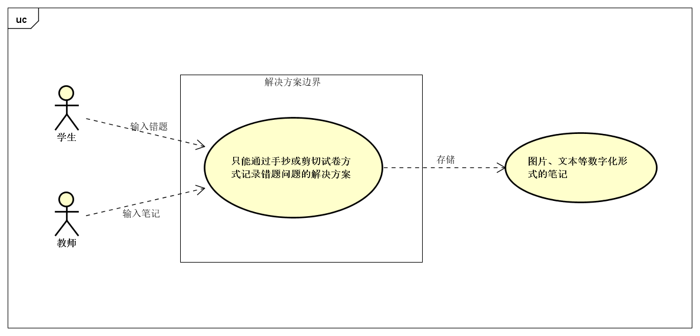

# 过程分析文档

## 问题达成共识

| 要素 | 内容 |
| --- | --- |
| ID | P1 |
| 提出者 | 学生 |
| 关联者 | 任课教师、班主任 |
| 问题 | 只能通过手抄或剪切试卷方式记录错题 |
| 影响 | 记录笔记的方式效率低下或者易损坏试卷，浪费时间精力 |

## 发现业务需求

| 要素 | 内容 |
| --- | --- |
| ID | P1 |
| 提出者 | 学生 |
| 关联者 | 任课教师、班主任 |
| 问题 | 只能通过手抄或剪切试卷方式记录错题 |
| 影响 | 记录笔记的方式效率低下或者易损坏试卷，浪费时间精力 |
| 目标 | 在系统投入使用三个月后，使学生花费在记录笔记上的时间减少50% |

## 解决方案

### 高层次的解决方案

| 问题 | 解决方案 |
| --- | --- |
| P1 | S1: 用户可以通过多种方式记录笔记(上传图片，在图片上编辑（裁剪、旋转、标注、水印），文本等) |

### 描述成表

| 要素 | 内容 |
| --- | --- |
| ID | P1 |
| 方案描述 | 用户可以通过多种方式记录笔记(上传图片，在图片上编辑（裁剪、旋转、标注、水印），文本等) |
| 业务优势 | 错题和笔记电子化，从而可以减轻手动抄题的负担；同时便于随时更改而不需要担心记录空间问题 |
| 代价 | 实现此功能模块所需要的软件费用，对学生和教师使用此系统记录笔记的培训费用 |

## 系统特性

| 针对的问题 | 解决方案需要具备的系统特性 |
| --- | --- |
| P1 | 1. 系统记录保存使用者的错题和笔记 |
| | 2. 系统允许已上传的错题和笔记可被编辑 |

## 约束

| 约束源 | 约束 | 理由 |
| --- | --- | --- |
| 操作性 | 需要对教师和学生进行相关记录和编辑笔记的培训 | 提高用户使用效率，方便进一步存储 |
| 系统及操作系统 | 数据库在服务器上大小不超过1TB | 控制成本，无冗余数据 |
| 设备预算 | 系统在已架构好的服务器和主机上开发 | 控制成本，开发简单 |
| 人员资源 | 不需要额外员工 | 固定操作成本 |
| 技术要求 | 良好的人机交互界面 | 方便用户使用该系统 |

## 涉众识别和描述

| 涉众 | 特征 | 主要目标 | 态度 | 主要关注点 | 约束条件 |
| --- | --- | --- | --- | --- | --- |
| 学生 | 普遍具有电子设备使用经验，乐于接受新事物 | 能够高效记录和利用错题和笔记，提高学习成绩 | 强烈支持 | 保证系统的低学习成本和使用方便性 | 无 |

## 涉众评估

| 用户群体 | 任务 | 群体数量 | 优先级 |
| --- | --- | --- | --- |
| 学生 | 记录和查看错题 | 500 | 3 |